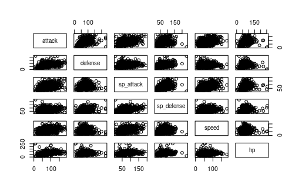

---
title: "Pokemon Report"
output: pdf_document
--- 

## Introduction

In case you've been hiding under a Geodude, Pokemon is a video game where you travel a fictional world filled with monsters that you can capture and battle with. Each generation of games introduced hundreds of more Pokemon that you can battle on your way to becoming a Pokemon champion.





## Generations
Let's compare the different generations. Legendary pokemon are rare and usually the most powerful ones. If you (like me) prefer Generations 1 & 2, I've got bad news. In terms of their power statistics, Gen 1 & 2 come up short on average
```{r, echo=FALSE}
readRDS('assets/legend_gen_tbl.rds')

``` 
They have the least legendary pokemon and the lowest stat averages once you remove said legendary pokemon. This is might be an example of powercreap as the designers look fo make the newer entries better than the previous gen, so they beef up their stats, but there is not a linear increase in any of the stats, so they vary from game to game. 
 
```{r, echo=FALSE}
readRDS('assets/avg_power_fig.rds')

``` 
Lastly lets look at a TSNE of all of the Pokemon to determine if each generation actually has any common trends in their design.


While there may be some broad clusters, certainly none of them are defined by any particular generation. Perhaps there are smaller patterns within each generation.

## Pokemon Type
One of the main features of the game are the gyms which each have a single type of pokemon (fire, water, grass, etc.) which force the player to change strategies to defeat each type. Let's consider which is the best type excluding legendary pokemon which have different types as well.

```{r, echo=FALSE}
readRDS('assets/avg_power_type.rds')

``` 
From looking at the plots of their stats, Dragon types have higher base stats than most other types and excel at sp attack (which affects non-physical, type specific attacks). Average stats vary which is important for having real differences in gameplay. 

```{r, echo=FALSE}
readRDS('assets/legend_type_tbl.rds') 

``` 


There do not seem to be any significant clusters in any of the types which means there is no significant trends that Pokemon types follow. The averages clearly show that types (on average) have strengths and weaknesses, but no significant trends are seen when looking at all of the power stats.

## Just for Kicks

Let's look at the heights and weights of each class of Pokemon in case you're the judgmental type who only want their Pokemon extra thick (Legendaries included).

```{r, echo=FALSE}
readRDS('assets/size_fig.rds')
```

The final question left to be asked:

Why is Generation 7 so thick? Most Legendaries? Have the designers final realized Chunky wins championships? The world may never know. 
